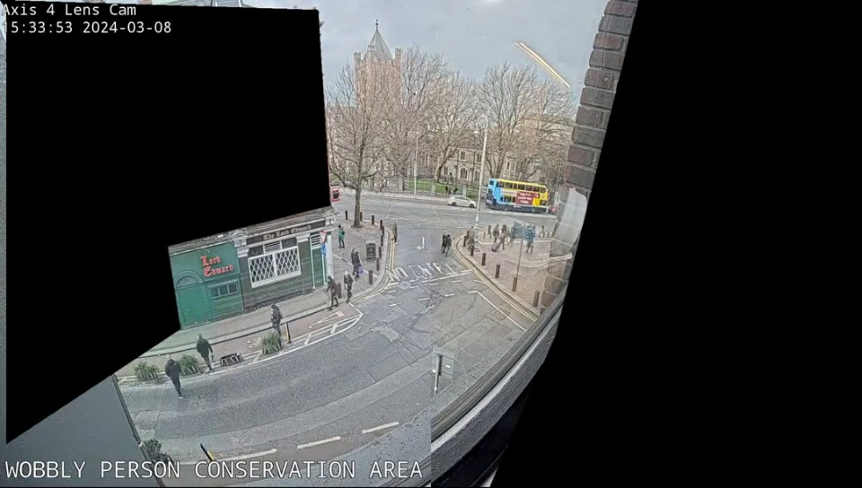
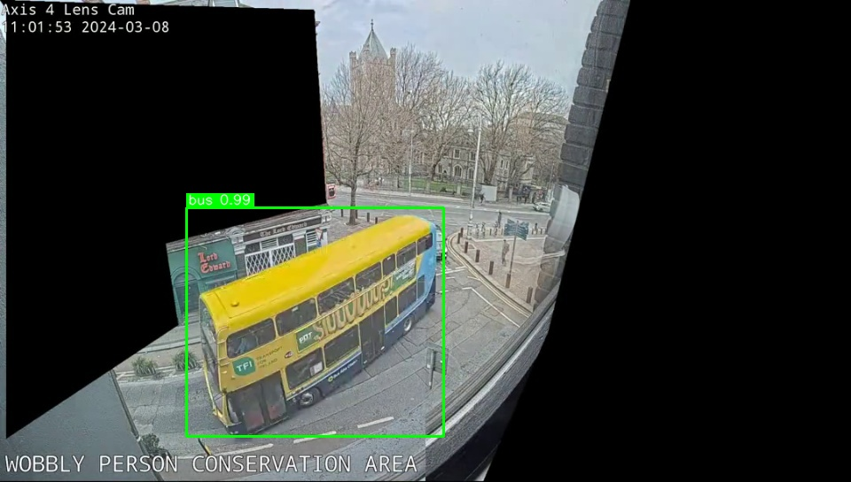

# Annotator Guidance - Best Practices

## Purpose

This document provides guidance for annotators working with pre-tagged datasets from the Protex AI pipeline. It explains common issues, priority areas, and quality standards.

---

## 🎯 Annotation Workflow

 
*Left: Raw frame | Right: Annotated with color-coded detections*

### 1. Start with Priority Review Areas

**Low Confidence Detections** (<0.5 confidence):
- These are most likely to need correction
- Model is uncertain → higher chance of false positives or misclassification
- Action: Verify, correct, or remove

**Rare Classes** (<1% of dataset):
- Low-frequency objects have higher error rates due to limited training data
- Examples: Fire extinguishers, specialized equipment, PPE items
- Action: Pay extra attention, add missing instances

**High Activity Frames** (>10 objects):
- Crowded scenes often have merged or overlapping detections
- Model may miss individuals in dense groups
- Action: Split merged boxes, ensure each person has individual annotation

---

## ⚠️ Common Issues & How to Handle Them

### Partial Occlusion
**Problem**: Workers behind equipment, partially visible objects  
**Indicators**: Low confidence (<0.6), incomplete bounding boxes  
**Action**: 
- If >50% visible → keep and adjust box to visible portion
- If <50% visible → remove annotation
- Flag frames with severe occlusion for client review

### PPE Misclassification
**Problem**: Hard hats confused with other headwear, safety vests missed in low light  
**Indicators**: Confidence 0.5-0.7 range, unusual colors  
**Action**:
- Verify against client safety protocols (color codes, required PPE)
- Cross-reference with high-confidence detections in similar lighting
- When in doubt, flag for supervisor review

### Small Object Detection
**Problem**: Fire extinguishers, tools, small equipment frequently missed  
**Indicators**: Empty frames where objects should exist, very small boxes  
**Action**:
- Manually add missing small objects (especially safety equipment)
- Focus on frames where workers interact with equipment
- Use context clues (worker posture, hand position)

### Lighting Artifacts
**Problem**: False positives at dawn/dusk due to shadows, reflections  
**Indicators**: Detections in unusual locations, very low confidence  
**Action**:
- Remove false positives caused by shadows/reflections
- Note frame IDs for client feedback on camera positioning
- Suggest time-of-day filtering if pattern is consistent

### Crowd Scenes
**Problem**: Overlapping workers in busy areas (loading docks, assembly lines)  
**Indicators**: Single large box covering multiple people, unusual aspect ratios  
**Action**:
- Split merged boxes into individual person annotations
- Ensure each person has separate bounding box
- Use head position as primary anchor point

---

## 📊 Quality Standards

### Bounding Box Guidelines

**Tight Fit**:
- Box should closely fit the object with minimal padding
- Include all visible parts of the object
- Exclude shadows and reflections

**Minimum Size**:
- People: ≥300 px² (safety-critical, lower threshold)
- Equipment: ≥1000 px² (standard threshold)
- If smaller, object may not be actionable for safety monitoring

**Aspect Ratio**:
- Person: 1:2 to 1:4 (width:height) typical
- Equipment: varies, but >10:1 likely indicates error
- Flag unusual aspect ratios for review

### Confidence Thresholds

| Confidence | Action |
|------------|--------|
| ≥0.8 | High quality - quick verification |
| 0.6-0.8 | Medium quality - standard review |
| 0.5-0.6 | Low quality - careful review |
| <0.5 | Very low - likely needs correction or removal |

---

## 🔍 Class-Specific Guidance

### Person (Safety-Critical)
- **Lower area threshold**: Accept smaller boxes (≥300 px²)
- **Priority**: Any human presence near equipment is safety-critical
- **Check for**: Partial occlusions, merged detections in crowds
- **PPE verification**: Cross-check for required hard hat, safety vest

### Equipment (Forklift, Machinery)
- **Standard threshold**: ≥1000 px²
- **Check for**: Proper class (forklift vs truck vs car)
- **Context**: Should appear in loading/industrial areas
- **Flag**: Equipment in unusual locations

### PPE (Hard Hat, Safety Vest)
- **Common issues**: Misclassification, missed in low light
- **Verification**: Must be associated with a person
- **Color codes**: Verify against client protocols
- **Lighting**: Extra attention in dawn/dusk frames

### Rare Objects (Fire Extinguisher, Tools)
- **High miss rate**: Model recall ~45% for rare classes
- **Manual addition**: Actively look for missing instances
- **Context clues**: Near exits, on walls, in worker hands
- **Importance**: Safety equipment is critical despite low frequency

---

## 📈 Temporal Patterns

### Activity Levels by Time Period

| Time Period | Expected Activity | Annotation Focus |
|-------------|-------------------|------------------|
| 00:00-06:00 | Low (2-3 objects/frame) | Lighting issues, false positives |
| 06:00-12:00 | High (6-8 objects/frame) | Crowd scenes, PPE compliance |
| 12:00-18:00 | Medium (4-6 objects/frame) | Standard review |
| 18:00-24:00 | Medium (4-5 objects/frame) | Lighting transitions |

**Insight**: Morning shift (06:00-12:00) shows peak activity and highest risk exposure → prioritize these frames for thorough review.

---

## ✅ Quality Checklist

Before submitting annotations, verify:

- [ ] All low-confidence detections (<0.5) reviewed
- [ ] Rare classes checked for missing instances
- [ ] High-activity frames reviewed for merged detections
- [ ] Empty frames flagged if unexpected
- [ ] PPE annotations verified against safety protocols
- [ ] Bounding boxes are tight-fit and properly sized
- [ ] No obvious false positives (shadows, reflections)
- [ ] Class labels are correct (not misclassified)

---

## 🚨 When to Flag for Supervisor Review

1. **Ambiguous cases**: Uncertain if object meets safety criteria
2. **Systematic issues**: Pattern of errors across multiple frames
3. **Camera problems**: Consistent lighting/focus issues
4. **Missing context**: Need client clarification on safety protocols
5. **Unusual detections**: Objects in unexpected locations or contexts

---

## 💡 Tips for Efficiency

1. **Batch similar frames**: Review frames from same time period together
2. **Use keyboard shortcuts**: Speed up box adjustments and class changes
3. **Start with high-confidence**: Build intuition before tackling difficult cases
4. **Take breaks**: Annotation fatigue leads to errors after 60-90 minutes
5. **Track your metrics**: Monitor your correction rate to identify weak areas

---

## 📞 Support

**Questions about**:
- Safety protocols → Contact client safety manager
- Technical issues → Contact CV Ops team
- Annotation guidelines → Contact annotation supervisor
- Dataset quality → Refer to docs/report.md (auto-generated)

---

**Remember**: Pre-tagging reduces your workload by ~70%, but human verification is critical for safety applications. When in doubt, flag for review rather than guessing.
